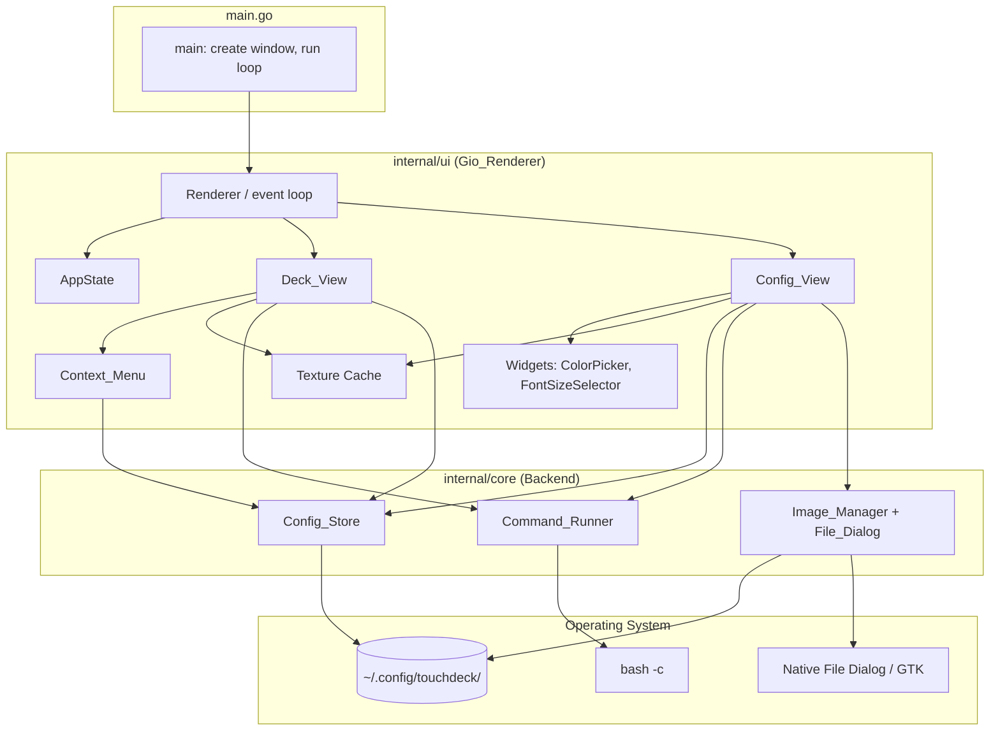

# Design Document

## Overview

TouchDeck is currently a Wails application: a Go backend (`app.go`) whose methods are
bound into a WebView (WebKitGTK) that runs a Svelte + Tailwind single-page app
(`frontend/src/App.svelte`). This design migrates the application to
[Gio](https://gioui.org), a pure-Go, GPU-accelerated, immediate-mode UI toolkit. Gio
draws every view natively, so the embedded HTML rendering engine, the Svelte/Tailwind
frontend, and the Wails-generated JS bindings are all removed.

The guiding principle is **preserve the backend, replace the frontend**. The logic in
`app.go` — configuration load/save with legacy migration, `bash -c` command execution,
and image copy/list — is already framework-agnostic apart from three Wails touch points.
That logic moves into a dedicated core package and is reused essentially unchanged. The
Svelte UI is re-implemented as a native Gio rendering layer that reproduces the deck grid,
pagination, tap feedback, and the split-pane configuration editor with full parity, and
adds two new capabilities: a runtime full-screen toggle and a long-press / right-click
context menu with copy and paste.

Linux (Fedora, Ubuntu, Linux Mint) is the acceptance target. Constructs are kept
cross-platform where practical, but the design does not over-engineer for Windows/macOS.

### Migration Strategy

**What stays (moves into the core `Backend` package, Wails calls removed):**

| Existing (`app.go`) | Disposition |
| --- | --- |
| `Config`, `PageConfig`, `ButtonConfig` structs | Kept verbatim, JSON tags frozen |
| `LoadConfig` (default creation + legacy flat→nested migration) | Kept, receiver changed from `*App` |
| `SaveConfig` (indented JSON) | Kept |
| `RunCommandAsync` (`bash -c`, fire-and-forget) | Kept |
| `RunCommandSync` (`bash -c`, 10s context timeout, combined output) | Kept |
| `getConfigPath` / `getImagesDir` (`os.UserConfigDir`) | Kept |
| `CopyImageToConfig` (timestamp-prefixed copy) | Kept |
| `ListConfigImages` (extension filter) | Kept |

**What is removed:**

- The Wails module dependency (`github.com/wailsapp/wails/v2`) and all its transitive
  dependencies (Requirement 1.2).
- The Svelte + Tailwind frontend (`frontend/src/`, `frontend/dist/`), the generated
  bindings (`frontend/wailsjs/`), and Node build tooling (Requirement 1.3).
- `wails.json` and the `//go:embed all:frontend/dist` asset-embedding directive in
  `main.go` (Requirement 2.4).
- `GetImageBase64` — a WebView workaround that returned a base64 `data:` URL because the
  WebView could not read local files directly. Gio decodes image files to GPU textures
  natively, so this method is deleted (no longer needed).
- The Wails runtime file dialog (`runtime.OpenFileDialog`) inside `SelectImage`, replaced
  by a native Go dialog library.
- The Wails startup context (`a.ctx context.Context`) captured in `startup`.

**What is added:**

- A **Gio_Renderer** UI layer: window creation, the immediate-mode event/render loop, and
  all views drawn natively.
- A native **File_Dialog** for image selection, backed by a Go-native dialog library.
- A runtime **full-screen toggle** (F11 and an on-screen control) using Gio's window
  full-screen mode (Requirement 7).
- A per-button **Context_Menu** opened by long-press or right-click, with edit / copy /
  paste actions and an in-memory **Button_Clipboard** (Requirement 8).

## Architecture

The application is split into two Go packages within the `touchdeck` module:

1. **`internal/core`** — the framework-agnostic Backend. It has no dependency on Gio or on
   any UI library. It owns configuration persistence (Config_Store), command execution
   (Command_Runner), and image handling (Image_Manager, including the native File_Dialog
   call). Because it is UI-free, it is fully unit- and property-testable.
2. **`internal/ui`** (plus `main.go`) — the Gio_Renderer. It owns the window, the event
   loop, the application state, and the Deck_View, Config_View, Context_Menu, and reusable
   widgets. It calls into `internal/core` for all side effects.

Keeping the File_Dialog inside `internal/core` (in the Image_Manager) matches the existing
code, where `SelectImage` lives alongside `CopyImageToConfig`. The dialog library
([`sqweek/dialog`](https://github.com/sqweek/dialog)) is a blocking, framework-independent
call, so it does not need to live in the Gio layer.

### Component Diagram



### Immediate-Mode Render Loop

Gio is immediate-mode: there is no retained widget tree. Each frame, the renderer reads
the current `AppState`, processes queued input events, and re-emits the entire scene as a
list of drawing operations. The loop:

1. Block on the window's event channel (`window.Event()`).
2. On a `app.FrameEvent`, build a `layout.Context` (`gtx`) from the event.
3. Process pending input: routed pointer events (taps, long-press timers, right-clicks),
   key events (F11), and widget events (buttons, editors).
4. Dispatch to the active view's layout function (`layoutDeck` or `layoutConfig`) based on
   `AppState.View`, which records drawing ops into `gtx.Ops`.
5. If a Context_Menu is open, layout it as an overlay on top of the active view.
6. Call `event.Frame(gtx.Ops)` to flush the frame to the GPU.
7. On `app.DestroyEvent`, exit.

Tactile flash (150 ms) and long-press (500 ms) are driven by timers that request a
redraw/invalidate so the loop wakes and re-evaluates elapsed time; no busy-waiting.

### Application State Model

`AppState` is the single source of UI truth held by the renderer between frames:

- **View** — which top-level view is active (Deck vs. Config).
- **Config** — the in-memory `core.Config` (mirrors the on-disk file).
- **CurrentPage** — active page index, 0–4.
- **SelectedSlot** — slot selected for editing in Config_View (nil when none).
- **Fullscreen** — whether the window is currently borderless full-screen.
- **Clipboard** — the Button_Clipboard (nil when empty).
- **CommandTest** — test-run state (running flag, output text, success flag).
- **Flash** — per-button tactile-flash timers (button id → flash deadline).
- **LongPress** — in-progress long-press tracking (target slot, press origin, start time).
- **Menu** — open Context_Menu state (target slot, screen position) or closed.
- **Editor** — the Config_View form fields (label, command, bgImage, colors, fontSize, id).
- **TextureCache** — decoded images keyed by absolute file path (see Data Models).

## Components and Interfaces

### `internal/core` — Backend

The Backend is a plain struct with no UI dependencies. The Wails `*App` receiver becomes a
`*Backend` receiver, and `startup`/`a.ctx` are dropped.

```go
package core

type Backend struct{}

func New() *Backend { return &Backend{} }

// Config_Store
func (b *Backend) LoadConfig() (Config, error)
func (b *Backend) SaveConfig(cfg Config) error
func (b *Backend) ConfigPath() (string, error)   // was getConfigPath
func (b *Backend) ImagesDir() (string, error)    // was getImagesDir

// Command_Runner
func (b *Backend) RunCommandAsync(command string) error
func (b *Backend) RunCommandSync(command string) (string, error)

// Image_Manager
func (b *Backend) SelectImage() (string, error)              // native File_Dialog
func (b *Backend) CopyImageToConfig(srcPath string) (string, error)
func (b *Backend) ListConfigImages() ([]string, error)
```

The migration and default-config logic inside `LoadConfig` is unchanged. To make the core
testable in isolation (so property tests do not touch the real `~/.config`), the path
helpers resolve their base directory through a single indirection that defaults to
`os.UserConfigDir` but can be overridden in tests (e.g., an unexported `configRoot` field
or a `TOUCHDECK_CONFIG_HOME`-style test seam). The public behavior on Linux is unchanged:
paths resolve to `~/.config/touchdeck/`.

`SelectImage` is re-implemented with the native dialog:

```go
func (b *Backend) SelectImage() (string, error) {
    return dialog.File().
        Title("Select Background Image").
        Filter("Images", "png", "jpg", "jpeg", "gif", "webp", "svg").
        Load()
}
```

`dialog.File().Load()` returns `dialog.ErrCancelled` when the user cancels; the
Image_Manager maps that to "no selection" so the caller leaves `bgImage` unchanged
(Requirement 13.3).

### `internal/ui` — Gio_Renderer

- **Renderer** — owns the `app.Window` and the event loop. Reads `AppState`, routes input,
  dispatches to the active view, overlays the Context_Menu, toggles full-screen.
- **Deck_View** — renders the runtime grid, handles taps, tap-flash, pagination,
  long-press / right-click, and the Context_Menu trigger.
- **Config_View** — renders the split-pane editor: grid preview (left), slot editor form
  (right). Owns grid adjusters, page selector, slot selection, all form fields, move
  controls, copy/paste, save/clear, and the test-run panel.
- **Context_Menu** — an overlay presenting edit / copy / paste for a target slot.
- **Widgets** — reusable `ColorPicker` (hex text field + swatch preview + live color) and
  `FontSizeSelector` (segmented -2 / -1 / Default / +1 / +2 control), matching the Svelte
  editor controls.

### Full-Screen Toggle

Full-screen is a window-level concern owned by the Renderer (Requirement 7):

- On start, the window is created windowed with a title (`app.Title("TouchDeck")`),
  satisfying 7.1.
- F11 key events and the on-screen control both call `toggleFullscreen`, which flips
  `AppState.Fullscreen` and issues `window.Option(app.Fullscreen)` or
  `app.Windowed` accordingly (7.2, 7.4). Gio's full-screen window mode hides the title bar
  (7.3).
- While full-screen, the on-screen control remains visible and returns to windowed mode
  (7.5).

To receive the F11 key, the Renderer registers a `key.Filter` for `key.NameF11` on a
focused root area each frame.

### Native File Dialog

The Image_Manager's `SelectImage` uses [`github.com/sqweek/dialog`](https://github.com/sqweek/dialog),
a small Go library that opens the platform-native file chooser. On Linux it uses GTK,
which implies **cgo and a GTK development dependency at build time** — acceptable because
WebKitGTK already pulled GTK in, so the target distros already satisfy it. The call is
blocking and independent of Gio, so it runs on a normal goroutine and its result is applied
to `AppState` on the next frame. This satisfies the native File_Dialog requirement (13.1)
while coexisting with Gio's own event loop.

### Image Decoding (Gio Textures)

Gio renders images from `paint.NewImageOp(img image.Image)`. Images are decoded with the
Go standard library: `image/png`, `image/jpeg`, `image/gif` (registered so
`image.Decode` handles `.png`, `.jpg`, `.jpeg`, `.gif`). The standard library does **not**
decode `.webp` or `.svg`. These extensions are still **listed** by `ListConfigImages`
(Requirement 13.7 freezes the extension set) and still selectable, but if decoding fails
the Deck_View degrades gracefully: it renders the slot's `bgColor` (or the default tile
background) and the label, and logs the unsupported-format error rather than crashing
(see Error Handling). A future enhancement may add `golang.org/x/image/webp` for WebP;
SVG would require a rasterizer and is out of scope.

## Data Models

### Persisted Models (frozen — JSON tags unchanged)

These are copied verbatim from `app.go` so existing `config.json` files load unchanged
(Requirement 3.2). Only the package changes.

```go
type ButtonConfig struct {
    ID        string `json:"id"`
    Label     string `json:"label"`
    Command   string `json:"command"`
    BgImage   string `json:"bgImage"`
    BgColor   string `json:"bgColor"`
    FontColor string `json:"fontColor"`
    FontSize  int    `json:"fontSize"`
    Order     int    `json:"order"`
}

type PageConfig struct {
    PageIndex int            `json:"pageIndex"`
    Buttons   []ButtonConfig `json:"buttons"`
}

type Config struct {
    Rows  int          `json:"rows"`
    Cols  int          `json:"cols"`
    Pages []PageConfig `json:"pages"`
}
```

The legacy decode helper (temporary struct with a top-level `buttons` array carrying a
`page` field) is retained inside `LoadConfig` to migrate Legacy_Config files
(Requirement 3.4).

### In-Memory UI Models (`internal/ui`)

```go
type View int
const (
    ViewDeck View = iota
    ViewConfig
)

const TotalPages = 5

// Button_Clipboard: copied button settings (no id/order — those belong to the slot).
type ButtonClipboard struct {
    Label     string
    Command   string
    BgImage   string
    BgColor   string
    FontColor string
    FontSize  int
}

// Editor form state mirrors the Svelte edit* variables.
type EditorState struct {
    ID        string
    Label     string
    Command   string
    BgImage   string
    BgColor   string // defaults "#1f2937"
    FontColor string // defaults "#ffffff"
    FontSize  int    // -2..+2
}

type CommandTestState struct {
    Running bool
    Output  string
    Success bool
}

type MenuState struct {
    Open     bool
    Slot     int      // target slot index
    Position f32.Point // screen position where menu opens
}

type LongPressState struct {
    Active bool
    Slot   int
    Origin f32.Point
    Start  time.Time
}

type AppState struct {
    Backend      *core.Backend
    View         View
    Config       core.Config
    CurrentPage  int
    SelectedSlot *int
    Fullscreen   bool
    Clipboard    *ButtonClipboard
    Editor       EditorState
    CommandTest  CommandTestState
    Menu         MenuState
    LongPress    LongPressState
    Flash        map[string]time.Time // button id -> flash-until deadline
    Textures     *TextureCache
}
```

### Texture Cache

The Svelte `base64Cache` (button id → data URL) is replaced by a texture cache keyed by
**absolute image path** (so identical images shared across buttons decode once):

```go
type TextureCache struct {
    mu    sync.Mutex
    items map[string]paint.ImageOp // abs path -> decoded op
    bad   map[string]bool          // paths that failed to decode (avoid retry storms)
}

func (c *TextureCache) Get(path string) (paint.ImageOp, bool) // decodes+caches on miss
func (c *TextureCache) Invalidate(path string)
```

On a cache miss the file is read and decoded via `image.Decode`; on success the resulting
`paint.ImageOp` is stored; on failure the path is recorded in `bad` and the caller renders
the color fallback.

## Detailed Component Design

### Config_Store (Requirements 3, 9.4, 10.6, 10.7, 11)

`LoadConfig` / `SaveConfig` are reused unchanged. Behavior confirmed against the existing
code:

- **Missing file** → build the default Config (2 rows, 4 cols, one page with 3 sample
  buttons), save it, return it (3.3).
- **Legacy_Config** (top-level `buttons[]` with `page` fields, no `pages`) → group buttons
  by `page` into `PageConfig` entries (3.4). *Note: the existing migration loop iterates a
  `map[int][]ButtonConfig`, so migrated page ordering is nondeterministic; the design
  preserves the existing behavior but the correctness property is stated over page
  membership, not slice order (see Correctness Properties).*
- **Modern config** (has `pages`) → load as-is (3.5).
- **Save** → indented JSON to `~/.config/touchdeck/config.json` (3.6).
- **Read failure** → return the error to the caller (3.7).

All Config_View mutations (grid resize prune, slot save/clear, move, paste) call
`SaveConfig` after updating the in-memory Config, matching the Svelte `saveConfig` flow.

### Command_Runner (Requirement 5, 12)

Reused unchanged:

- `RunCommandAsync` — `bash -c`, `Start()` then `Wait()` in a goroutine; deck taps use this
  so the UI never blocks (5.1). Empty command → the Deck_View skips execution (5.3).
- `RunCommandSync` — `bash -c` under a 10 s `context.WithTimeout`, returns
  `CombinedOutput`; on deadline returns a timeout error (5.4, 5.5). Used by the test-run
  panel; run on a goroutine with the result applied to `CommandTest` on the next frame so
  the UI shows an "executing" state (12.5).

### Image_Manager (Requirement 13)

- `SelectImage` → native File_Dialog filtered to image types (13.1); cancel → unchanged
  bgImage (13.3).
- `CopyImageToConfig` → copy into `~/.config/touchdeck/images/` with a
  `time.Now().UnixNano()`-prefixed filename, return the destination path, which becomes the
  button's `bgImage` (13.2). Reused unchanged.
- `ListConfigImages` → list only `.png/.jpg/.jpeg/.gif/.webp/.svg` (13.7); feeds the
  Config_View dropdown (13.4). Reused unchanged.
- The choose-file flow: `SelectImage` → (if not cancelled) `CopyImageToConfig` →
  set `Editor.BgImage` → refresh the image list. The dropdown selection sets
  `Editor.BgImage` directly (13.5); clear sets it to empty (13.6).

### Gio_Renderer — Main Loop & Full-Screen (Requirements 1.5, 1.6, 7)

- Creates the window windowed with title bar; first frame shows Deck_View
  (`AppState.View = ViewDeck`) (1.6, 7.1).
- A persistent header/control provides Deck ⇄ Config switching (1.5) and the full-screen
  control (7.4, 7.5).
- F11 handling and the control both call `toggleFullscreen` (7.2). Full-screen mode is
  borderless (no title bar) via Gio's full-screen window option (7.3).

### Deck_View (Requirements 4, 5, 6, 8)

**Grid layout math.** For an `R×C` grid the view lays out `R` rows of `C` equal cells
using `layout.Flex`. Slot index `i = row*C + col`. The last two indices are reserved:
`prevSlot = R*C-2`, `nextSlot = R*C-1` (Pagination_Slots). Guard: when `R*C < 2` (e.g.
1×1) the pagination reservation is not meaningful; the design assumes at least a 1×2 grid
for pagination to exist, consistent with the reserved-slot model in the Svelte source.

**Content resolution.** For each non-pagination slot `i`, find the button on the current
page whose `order == i` (`getButtonAtSlot`) (4.8). Render precedence:

1. If a button exists and has a label, bgImage, or command → render it (4.2):
   - bgImage present and decodable → draw the texture scaled to cover, centered, with a
     translucent dark overlay for text contrast (4.3).
   - else bgColor present → fill with that color (4.4); default `#1f2937` otherwise.
   - draw label centered in `fontColor` (4.5) at `defaultSize + offset` where offset ∈
     {-2,-1,0,+1,+2} maps to concrete point sizes (4.6).
2. Otherwise → dashed empty placeholder (4.7).

**Tap handling + flash (5.1–5.3, 4).** A tap on a configured button with a non-empty
command calls `RunCommandAsync` and records `Flash[button.id] = now + 150ms`. While
`now < Flash[id]` the tile is drawn with the highlight color (`#3b82f6`); an invalidate is
scheduled at the deadline so the highlight clears (5.2). Empty-command taps do nothing
(5.3).

**Pagination (6).** `prevSlot` renders a Prev control; tap → `CurrentPage =
(CurrentPage-1+TotalPages) % TotalPages` (6.4). `nextSlot` renders a Next control with a
`current+1 / TotalPages` indicator; tap → `CurrentPage = (CurrentPage+1) % TotalPages`
(6.3, 6.5). `TotalPages = 5` (6.1).

**Long-press / right-click → Context_Menu (8).** Each non-pagination slot registers a
pointer input area:

- Right-click: a `pointer.Press` with `Buttons == pointer.ButtonSecondary` opens the menu
  immediately for that slot (8.2).
- Long-press: on primary press, start `LongPress{Slot, Origin, Start}`. Each frame, if the
  press is still held, movement stayed within a 10 px radius, and elapsed ≥ 500 ms, open
  the menu (8.1). A release or a >10 px drag before the threshold cancels the long-press
  and is treated as a normal tap.
- Pagination slots suppress the menu entirely (8.8).

**Context_Menu overlay (8.3–8.9).** When `Menu.Open`, an overlay is laid out at
`Menu.Position` with Edit / Copy / Paste:

- **Edit** → set `View = ViewConfig`, select the target slot (load its values into
  `Editor`), close the menu (8.4).
- **Copy** → `Clipboard = &ButtonClipboard{...target button settings...}`, close (8.5).
- **Paste** → apply `Clipboard` to the target slot's button (preserving that slot's `order`
  and generating/keeping an `id`), `SaveConfig`, close (8.6). Disabled/greyed when
  `Clipboard == nil` (8.7).
- Tapping outside the menu closes it with no action (8.9).

### Config_View (Requirements 9, 10, 11, 12)

**Split-pane layout (9.1).** A horizontal `layout.Flex` with two equal panes: left = grid
preview + controls, right = slot editor form (or a placeholder prompt when no slot is
selected).

**Grid preview + adjusters (9.2–9.4).** Renders the current page's slots as selectable
tiles (pagination slots shown as non-editable `[Prev Page]` / `[Next Page]` previews,
9.8). Rows and Cols each have `-`/`+` adjusters clamped to a minimum of 1 (9.3). On a
size change, prune every page's buttons whose `order >= rows*cols` and `SaveConfig`
(9.4); if the selected slot is now out of bounds, clear the selection.

**Page selector (9.5, 9.6).** Five buttons (Page 1–5); selecting one sets `CurrentPage`
and clears the selection so the newly selected page's slots are shown.

**Slot selection (9.7, 9.8).** Selecting an editable slot loads the existing button's
values into `Editor`, or initializes an empty button with a generated id
(`btn_<random>`) and default colors when the slot is unconfigured (9.7). Pagination slots
are non-selectable (9.8).

**Slot editor fields (10.1–10.5).** Label single-line editor (10.1); Command multi-line
editor (10.2); tile-color ColorPicker for bgColor (10.3); text-color ColorPicker for
fontColor (10.4); FontSizeSelector segmented control offering -2/-1/Default/+1/+2 (10.5);
the background-image dropdown + Choose File + Clear (13.4–13.6).

**Save / Clear (10.6, 10.7).** Save writes the editor's `label, command, bgImage, bgColor,
fontColor, fontSize, order(=selected slot)` into the current page (replacing any button at
that order) and calls `SaveConfig` (10.6). Clear removes the button at the selected slot
and saves (10.7).

**Move / swap logic (11.1–11.4).** Left/Up/Down/Right compute the adjacent slot using
row/col arithmetic (`left: col>0`, `right: col<cols-1`, `up: row>0`, `down: row<rows-1`).
A move swaps the buttons at the selected and target slots by rewriting their `order`
fields, then saves and follows the selection to the target slot (11.2, 11.4). If the
target is a Pagination_Slot or outside the grid, the Config is unchanged (11.3).

**Copy / paste settings (11.5–11.7).** Copy stores the editor's current settings in the
Button_Clipboard (11.5). Paste applies the clipboard to the selected slot and saves
(11.6); paste is presented as unavailable when the clipboard is empty (11.7). This shares
the same `ButtonClipboard` used by the Deck_View Context_Menu.

**Test-run panel (12).** Runs `RunCommandSync` on the current editor command on a
goroutine. While running, show an "Executing…" indicator (12.5). Empty command → show a
"no command to test" message (12.3). Success → show combined output (12.2). Error →
show the error output and mark failure (12.4).

### Context Menu ⇄ Editor Integration

The Context_Menu (Deck_View) and the Config_View editor operate on the **same**
`AppState.Clipboard`, so a button copied via long-press on the deck can be pasted in the
editor and vice versa. The menu's Edit action is the bridge from the deck to the editor:
it switches `View`, sets `CurrentPage`/`SelectedSlot`, and loads the target button into
`Editor` using the same selection routine the Config_View grid uses.

## Correctness Properties

*A correctness property is a characteristic or behavior that should hold true across all
valid executions of a system — essentially, a formal statement about what the system should
do, serving as the bridge between human-readable specifications and machine-verifiable
correctness guarantees.*

These property-based tests target the **framework-agnostic core** (`internal/core`) and
the pure state-transformation helpers extracted from the UI layer (grid math, pagination,
slot swap, prune, slot-write). The Gio drawing and gesture code is inherently visual and
event-driven and is verified by manual/GUI testing and integration tests instead (see
Testing Strategy). Command execution and the native file dialog are external side effects
covered by integration tests, not properties.

### Property 1: Configuration round-trip

*For any* valid `Config`, saving it with `SaveConfig` and then reading it back with
`LoadConfig` SHALL produce a `Config` equal to the original (same rows, cols, and — up to
page ordering — the same pages and buttons).

**Validates: Requirements 3.2, 3.5, 1.4**

### Property 2: Legacy migration preserves membership

*For any* Legacy_Config (a flat set of buttons each carrying a `page` value), migrating it
into the nested `pages` structure SHALL place every button on the page whose `pageIndex`
equals that button's `page`, and SHALL neither drop nor duplicate any button (total button
count is preserved and each page's button set equals the buttons with that page value).

**Validates: Requirements 3.4**

### Property 3: Grid-size prune invariant

*For any* `Config` and *any* new grid dimensions (rows ≥ 1, cols ≥ 1), after applying the
grid-size change no page SHALL contain a button whose `order` is greater than or equal to
`rows * cols`.

**Validates: Requirements 9.3, 9.4**

### Property 4: Slot-swap is a self-inverse

*For any* page and *any* valid move (target slot in-bounds and not a Pagination_Slot),
applying the move SHALL swap exactly the buttons at the selected and target slots (their
`order` fields exchanged) and leave all other buttons unchanged; applying the opposite move
SHALL restore the page to its original state. *For any* invalid move (target out of bounds
or a Pagination_Slot), the page SHALL be unchanged.

**Validates: Requirements 11.2, 11.3**

### Property 5: Pagination wrap

*For any* page index `p` in `0 .. TotalPages-1`, advancing SHALL yield
`(p + 1) mod TotalPages` and going back SHALL yield `(p - 1 + TotalPages) mod TotalPages`;
consequently going back after advancing (and advancing after going back) SHALL return the
original page index, and every result SHALL remain in `0 .. TotalPages-1`.

**Validates: Requirements 6.3, 6.4**

### Property 6: Button-order uniqueness per page

*For any* sequence of slot-write operations (save, paste), clear, move, and grid-prune
operations applied to a `Config`, every page SHALL retain at most one button per `order`
value (no two buttons on the same page share an `order`).

**Validates: Requirements 4.8, 10.6, 11.2**

### Property 7: Slot-write preserves fields and order

*For any* editor/clipboard button settings and *any* editable target slot, writing those
settings to the slot (via save or paste) SHALL result in the current page containing a
button at that slot whose `label`, `command`, `bgImage`, `bgColor`, `fontColor`, and
`fontSize` equal the written settings and whose `order` equals the target slot index,
replacing any button previously at that slot.

**Validates: Requirements 8.6, 10.6, 11.6**

### Property 8: Image copy preserves content and naming

*For any* source image file, `CopyImageToConfig` SHALL create a file in the images
directory whose byte content equals the source file's content and whose name is the source
base name prefixed by a numeric timestamp and an underscore (`<digits>_<basename>`), and
SHALL return that destination path.

**Validates: Requirements 13.2**

### Property 9: Image listing extension filter

*For any* set of files placed in the images directory, `ListConfigImages` SHALL return
exactly the paths of files whose lower-cased extension is one of
`.png, .jpg, .jpeg, .gif, .webp, .svg` — including every such file and excluding every
other file and all subdirectories.

**Validates: Requirements 13.7**

## Error Handling

- **Config read failure (3.7).** `LoadConfig` returns the underlying error (open,
  decode) to the caller. The Renderer surfaces a non-fatal message and, where sensible,
  continues with an in-memory default so the app remains usable; a corrupt file is never
  silently overwritten unless the user saves.
- **Missing config file (3.3).** Not an error: `LoadConfig` creates and saves the default
  config. A failure to *save* the default is tolerated (the existing code ignores it) and
  the in-memory default is still returned.
- **Config write failure.** `SaveConfig` returns its error; Config_View operations that
  save (resize, save slot, clear, move, paste) report the failure to the user and keep the
  in-memory Config so no edits are lost.
- **Missing directories.** `ConfigPath`/`ImagesDir` `MkdirAll` the target directories
  (0755) before use, so a first run with no `~/.config/touchdeck/` creates it.
- **Image copy failure (13.2).** `CopyImageToConfig` returns an error (open/create/copy);
  the editor leaves `bgImage` unchanged and reports the failure.
- **File dialog cancel (13.3).** Mapped from `dialog.ErrCancelled` to "no selection";
  `bgImage` is left unchanged. Other dialog errors are reported and `bgImage` unchanged.
- **Unsupported / undecodable image (webp, svg, corrupt).** The TextureCache records the
  path as bad and the Deck_View / preview falls back to the tile color and label; the app
  does not crash. The path remains listed and selectable.
- **Command execution.** `RunCommandAsync` returns start errors (rare); the deck logs and
  ignores them so a bad command never blocks the deck. `RunCommandSync` returns a
  descriptive timeout error after 10 s (5.5) and otherwise returns combined output plus any
  non-zero-exit error, which the test-run panel shows as failure (12.4).

## Testing Strategy

### Dual Approach

- **Unit tests** — specific examples, state transitions, and edge cases: default-config
  creation, path resolution under a redirected config root, indented-JSON formatting,
  malformed-config error, grid math (index ↔ row/col), fontSize offset mapping,
  `getButtonAtSlot`, `isRenderable` predicate, pagination indicator string, view/selection
  state actions (edit, page-select, slot-select, clear, copy, dismiss), and clipboard
  guard behavior (empty → paste unavailable).
- **Property-based tests** — the nine correctness properties above, exercising the core
  and the pure state helpers across many generated inputs.
- **Integration tests** — the Command_Runner against real `bash` (echo output, stderr
  capture, non-zero exit, and a bounded `sleep`-based timeout check) and a single
  copy-file round trip through `CopyImageToConfig`.
- **Manual / GUI verification** — the Gio layer (rendering, gestures, full-screen,
  dialogs) that cannot be meaningfully unit-tested.

### Property-Based Testing Library

Use [`github.com/leanovate/gopter`](https://github.com/leanovate/gopter) for Go
property-based testing (rich generators and shrinking for structured types like `Config`).
`testing/quick` from the standard library is an acceptable lighter-weight fallback for the
simpler numeric properties (pagination wrap, prune). Do **not** hand-roll a PBT engine.

- Each property test runs a **minimum of 100 iterations** (gopter's `MinSuccessfulTests`).
- Custom generators produce valid `Config` values (bounded rows/cols, pages 0–4, buttons
  with in-range `order`, `fontSize` in −2..+2, arbitrary label/command/color strings) and
  Legacy_Config values (flat buttons with `page` fields).
- Property tests operate against a temporary config root (redirected `ConfigPath`/
  `ImagesDir`) so they never touch the real `~/.config` and can run in parallel/CI.
- Each property test is tagged with a comment referencing its design property, e.g.:
  `// Feature: wails-to-gio-migration, Property 1: Configuration round-trip`.

The mapping from each property to its target under test:

| Property | Target under test |
| --- | --- |
| 1 Config round-trip | `core.SaveConfig` + `core.LoadConfig` (temp root) |
| 2 Legacy migration membership | `core.LoadConfig` on generated legacy files |
| 3 Grid-size prune invariant | pure `pruneToGrid(cfg, rows, cols)` helper |
| 4 Slot-swap self-inverse | pure `moveButton(page, sel, dir)` helper |
| 5 Pagination wrap | pure `nextPage` / `prevPage` helpers |
| 6 Order uniqueness per page | sequence of pure write/clear/move/prune helpers |
| 7 Slot-write preserves fields+order | pure `writeSlot(page, slot, settings)` helper |
| 8 Image copy content+naming | `core.CopyImageToConfig` (temp images dir) |
| 9 Image list extension filter | `core.ListConfigImages` (temp images dir) |

Extracting the grid/pagination/swap/prune/slot-write logic into **pure helper functions in
`internal/core`** (operating on `Config`/`PageConfig` values, no Gio types) is a deliberate
design choice: it lets the highest-value UI logic be property-tested without a display
server, while the Gio views become thin adapters that call these helpers and draw the
result.

### GUI / Manual Verification Notes

Manually verify on the Linux target: view switching (1.5); Deck_View on start (1.6);
image cover/center, color fill, font color, font-size offsets, dashed placeholders
(4.3–4.7); 150 ms tap flash (5.2); pagination controls and indicator (6.2, 6.5);
full-screen via F11 and on-screen control, title-bar hidden in full-screen, return control
(7.1–7.5); long-press and right-click menus, pagination-slot suppression, edit/copy/paste,
dismiss (8.1–8.9); split-pane preview, adjusters, page selector, slot selection, all form
fields, move controls, test-run states (9–12); native file dialog and dropdown/clear
(13.1, 13.4).

### Build & Platform Verification (Requirement 14)

- `make build` produces a runnable binary via the Go/Gio toolchain with no `wails` command
  (2.1, 2.2); `make clean` removes build output (2.3).
- Verify no Wails/WebView imports remain (`go list -m all` free of `wailsapp/wails`) and
  that `wails.json`, the Svelte/Tailwind frontend, generated bindings, and the
  `//go:embed frontend/dist` directive are gone (1.2, 1.3, 2.4).
- Build and smoke-run on Fedora, Ubuntu, and Linux Mint, confirming the GTK/cgo file-dialog
  dependency is satisfied on each (14.1). Keep constructs cross-platform where practical
  (14.4).
